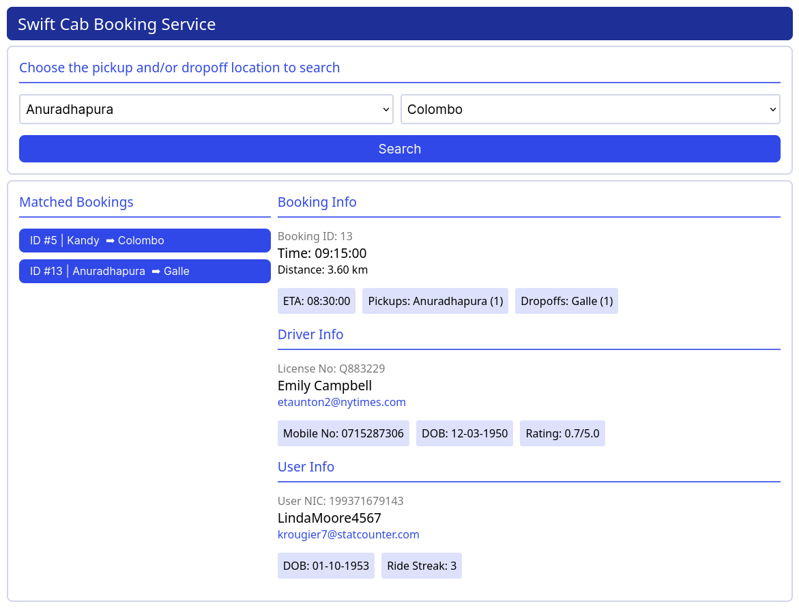

# Swift Cab Booking Service Interface
## CINEC HND Batch 14 - Database Design

## What is this project about?

This project is a personal extension to my Pearson HND in Computing Database assignment which focuses on designing a database for a Swift Cab booking service. 

*You can use this as a guidance to interfacing Python with Microsoft SQL* and for *your own assignment if and when needing inspiration*.

This extension features an interface that builds on top of the data layer provided by Microsoft SQL to allow users to **quickly search bookings based on pickup and/or dropoff location**.



## How does this interface work?

1. A Flask server is used to host the web app on your local host.
2. On loading, the flask server's `/` route uses Jinja templating to populate the *pickup and dropoff location dropdowns with selectable options*.
3. The user can **select a pickup / dropoff location from the dropdown** - upon which clicking the search button will send a POST request to the Flask backend to query the associated Microsoft SQL database.
4. If results are found, **a JSON payload of the queried data is served back to the frontend, which is then parsed on to the interface as a *list of booking;*** given below is a SQL query used to generate this JSON:

```python
cursor.execute("""
    SELECT
        DISTINCT(B.BookingID),
        CONVERT(VARCHAR, B.BookingTime, 108) AS "BookingTime",
        CONVERT(VARCHAR, B.ETA, 108) AS "ETA",
        CONVERT(VARCHAR, B.Distance) AS "Distance",
        D.LicenseNo,
        D.FirstName + ' ' + D.LastName AS "FullName",
        D.Email AS "DriverEmail",
        D.MobileNo,
        CONVERT(VARCHAR, D.DOB, 105) AS "DriverDOB",
        CONVERT(VARCHAR, D.Rating) AS "Rating",
        U.NIC,
        U.Username,
        U.Email AS "UserEmail",
        CONVERT(VARCHAR, U.DOB, 105) AS "UserDOB",
        CONVERT(VARCHAR, U.RideStreak) AS "RideStreak"
    FROM BOOKING AS B
    INNER JOIN DRIVER AS D ON D.DriverID = B.DriverID
    INNER JOIN "USER" AS U ON U.UserID = B.UserID
    INNER JOIN BOOKING_LOCATIONS AS BL ON BL.BookingID = B.BookingID
    INNER JOIN LOCATIONS AS L ON L.LocationID = BL.LocationID
    WHERE BL.LocationType = 'Pickup' AND L.LocationName = %s
    OR BL.LocationType = 'Dropoff' AND L.LocationName = %s; 
""", (pickupLocation, dropffLocation))
user_driver_data = cursor.fetchall()
```
5. The user can then click a booking of choice from the list and **get more details of it (in terms of the booking itself, and the associated user and driver) on the right.**